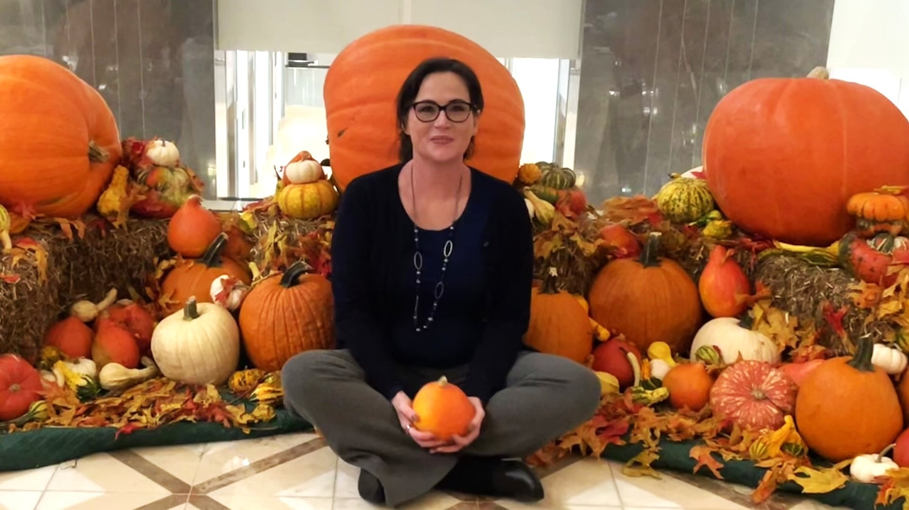

# How a Blank Canvas Helped Me Find Purpose

By Jolie Lizana

Publication date: January 5, 2026

---

<!-- BTA_IMAGE_START -->

*Image paired with “How a Blank Canvas Helped Me Find Purpose.” (Courtesy of Jolie Lizana)*

<!-- BTA_IMAGE_END -->

My life plans were set. I had a color-coded canvas with just a few final details and colors to fill in before I admired my masterpiece. I was enjoying life, with no preparations or tools for what was to come next.

Though I’d been bouncing from one specialist to another, I was nearly dead by the time I received my diagnosis of bilateral pulmonary embolisms, diastolic, systolic, and right-sided heart failures, and severe pulmonary arterial hypertension. Two years later, this was followed up with a diagnosis of diffuse cutaneous systemic sclerosis (dcSSc), which I refer to as internal scleroderma.

My life’s work, a vibrant masterpiece, became overshadowed by so much uncertainty. It was as if a gallon of white paint had been tossed onto my canvas, wiping away my achievements and my purpose. For years to come, I would stare at the wreckage, trying to figure out what was still possible.

Nothing seemed salvageable. I felt so alone. The isolation accompanying a life-altering diagnosis is overwhelming. It’s as though we're thrust into a parallel universe that no one can translate. I didn’t have the bandwidth or words to digest or articulate my thoughts and emotions.

I was holding on so tightly to claim what life I had left, to keep control of any aspect of my life that I could, and was insistent that I was going to beat my diagnosis. I was a mess; my mind was all over the place. Suddenly, it hit me, “I’m grieving!” I was fighting to stay alive, having an identity crisis, and grieving in a desolate place.

## The Turning Point

After years of denying and fighting my new reality, I finally gave in. I stopped trying to “beat” my conditions and instead chose to live alongside them. This shift brought about an unexpected sense of relief. And once I accepted my limitations, the internal struggle ended; I had a profound sense of inner peace.

For so many years, I thought of letting go as admitting defeat. But it felt more like a victory. For me, thriving meant letting go. Accepting my new reality gave me permission to be sick, to rest, to simply live in the body I have.

I began to move forward. I began to work on my canvas, which I finally saw as a blank canvas on which I could start fresh, rather than a painting that had been destroyed. I stopped waging war against myself and let myself grow from where I sat. Better yet, I permitted myself to fight the disease in unexpected ways.

## Finding Purpose

Enter Advocacy - not as a grand mission but as a way to fight back.

I don’t start small. I launched Breathtaking Awareness as a website and platform for social media to share information. I organized walks and awareness events. I also set up a booth at the world's largest free fair to distribute information in hopes of saving others from the pitfalls of rare disease. This is when I truly began to find others who not only understood my struggles and offered support, but also, like me, who want to advocate for change and awareness.

This not only gave me purpose but also a community of people who understand what my life is like. People who "get it!" I've met so many amazing people who have inspired me and given me the strength and courage to do more.

I soon realized that I would never again be alone in anything. Sometimes we can feel that way, but all we have to do is reach out to another person in the Rare Disease Community (RDC). There are amazing people who can support us, and who need our support.

By joining various patient organizations, I received legislative advocacy training, and doors began to open that I never imagined I'd walk through. And the best part is that I don't go through them alone. Legislative advocacy is essential to medical reform and legislative action. However, many opportunities advocate in varied ways.

Along with the other advocacy I do, I’m writing for Pulmonary Hypertension News (Bionews), co-hosting a podcast for The Pulmonary Hypertension Association, and am a member of the PHA’s PHPN and PACE programs. I’m also back in college for a degree in Mass Communications.

Advocacy gave me my life back. Better yet, it gave me a new life, with a renewed, more meaningful sense of purpose, transforming my story from "I" to "We."

I still grapple with feelings of depression and anxiety. Unfortunately, they are a part of living with chronic illness, and these emotions can lead to withdrawal, intensifying feelings of isolation. There are a few ways I use advocacy to help me cope when I begin to feel isolated. I know they will help you, too.

## Advocate for yourself and others to create a connection:

### Use Your Resources:

Take a moment to connect with others and elevate their advocacy work by commenting on their posts, hitting “like,” and sharing what hits home for you. This helps advocates know they are doing meaningful work and that they are not sending messages into the void.

Reach out to online support groups, patient groups, patients, and advocates. Those in the rare disease community want to help one another and look for support through social media and LinkedIn. It is up to you to make that connection.

### Advocate (at your pace and in your way):

There are no set times, and no dates or times that advocacy is “closed.” And there are so many ways to advocate. From posting, “Thanks for your work!”, sharing information and resources, speaking to legislation or at a town hall meeting, to finding an opportunity to share your story, each and every thing you do cultivates an incredible sense of purpose and binds you to a supportive community.

I felt so alone, like no one else could understand what I was going through, as though I were insignificant, as though my life had no purpose. Then, I realized that being sick doesn’t disqualify me from a meaningful, joyful life or from making a positive impact on this world, and that through advocacy, I would never again be alone.

Our advocacy network is composed of some of the strongest individuals on the planet, and together, we can navigate any path with hope, courage, and a strong sense of purpose.

When your canvas gets dirty, you clean it off. When paint spills, you don’t walk away, wishing it had never gotten messed up; you work through the mess. Sometimes the painting becomes breathtaking despite the flaws, and sometimes, when you hang in there, it becomes breathtaking because of them.
