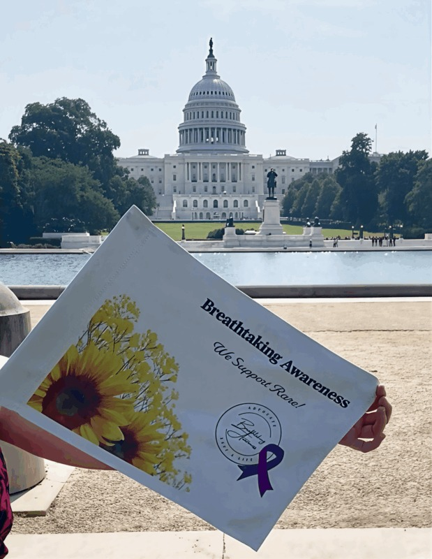

# Advocating for the PH community is meaningful work; it helps me too

**Thank you for reminding me that I am enough**

By Jolie Lizana

Publication date: November 14, 2025

## Image/caption placement

Image 1: images/articles/phlip-side/advocating-ph-community-support-rare.jpg

Caption: A PH advocate finds hope in new research, anxiety at the airport.

Alt text: A person holds a sign that reads “Breathtaking Awareness, We Support Rare!” with a sunflower and purple ribbon in front of the U.S. Capitol building on a sunny day.

---

<!-- BTA_IMAGE_START -->

*A PH advocate finds hope in new research, anxiety at the airport.*

<!-- BTA_IMAGE_END -->

There’s something truly rewarding about knowing you’ve helped someone.

There is no final goal or checklist to accomplish when that happens — it’s an immediate feeling of success and fulfillment! It’s one way that I, along with others in our PH community, know we are doing meaningful work.

As November is Pulmonary Hypertension Awareness Month, I encourage you all to reach out to those in the community who have made a difference in your life. Thank those who may not even realize how much their words have impacted you. Let those who inspire, motivate, support, and encourage you know how grateful you are for their encouragement and outreach.

## A word of thanks

You never know how much your “thank you” will mean to them — or even how much it will lift your spirits when you receive gratitude in return.

I know it will mean something to me.

I push myself to advocate, educate, and support our PH community. But I often struggle to reach that point where I can feel fulfilled and recognize that I’ve done enough — or, even better, that I’ve excelled. I keep pushing myself.

No matter what I accomplish, I never feel entirely finished, and I struggle to relax or enjoy my achievements.

So, please send a quick message, make a post, or call to let those who have supported you on your PH journey know that their efforts are meaningful and something to be proud of.

Let’s connect more on the forums this month. Consider contacting your local support group to explore ways you can help raise awareness, learn more about PH, and educate others about it.

Listen to the first episode of the second season of the Pulmonary Hypertension Association’s podcast, PH Insights. I am a co-host alongside another patient and a PH physician. Please tune in and share the link with others to learn more about advocating for yourself.

Feel free to share topics you’d like to know more about in the comments. You can also follow me on Instagram or Facebook and learn more about my journey and PH at BreathtakingAwareness.com.

Our community is incredible, and I’m so grateful to all of you! When my attention deficit hyperactivity disorder, anxiety and stress kick in, you remind me that my advocacy is making a difference. Thank you for reminding me that I am enough. Happy Pulmonary Hypertension Awareness Month!
