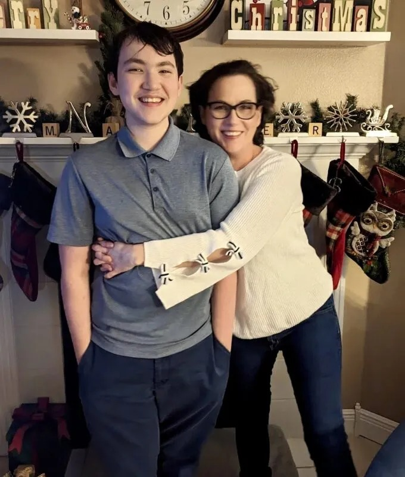

# Being mindful of good moments helps me through difficult times

**A ‘time capsule’ was an early mindfulness technique to recall good times in my life**

By Jolie Lizana

Publication date: December 12, 2025

## Image/caption placement

Image 1: images/articles/phlip-side/mindful-good-moments-holiday.jpg

Caption: Jolie Lizana and her son share a holiday moment. (Courtesy of Jolie Lizana)

Alt text: A smiling woman in glasses hugs a smiling teenage boy in front of a decorated fireplace with stockings, greenery, snowflakes, and a clock.

---

<!-- BTA_IMAGE_START -->

*Jolie Lizana and her son share a holiday moment. (Courtesy of Jolie Lizana)*

<!-- BTA_IMAGE_END -->

When I was younger, I created what I call my “time capsule.” I made a point of preserving moments that felt beautiful, thrilling, or special by fully engaging all my senses, while also taking note of my emotions. In those fleeting instances, it felt as if I had frozen time.

It’s not that hard to do. The next time you find yourself in a moment you’d like to be able to revisit, just take a good look around. What do you see? Smell? Taste? Hear? What do you feel, and what are you feeling? That is, what emotions are present in you and others? Take a minute to brand those things into your mind, and there you go, you’ve begun your time capsule — a vibrant memory that will never leave you.

When we’re sick, or even as we get older, we tend to become less active, making our minds and memories even more important. I am thankful I have several vivid memories I’ve stored in my time capsule from when I was younger — times with loved ones and friends, moments I would never have been able to simply conjure up. These memories remind me of what matters most to me: my family and the time I spend with them.

Now that I have systemic sclerosis, pulmonary hypertension, and heart failure, I find myself wishing I had stored more of them, because when our health limits our physical abilities, we have to find things to help us cope mentally.

## Remembering mindfulness

Somewhere along the way, I stopped capturing these moments for my capsule. This saddens me because I’ve experienced wonderful things since then. I can recall many of them, but the memories aren’t as vivid as the ones in my time capsule.

We tend to get lost in the negative around us. We recall the negative so easily, in part, because we are wired to survive. But mentally capturing the good moments in our lives helps us in the present and also later in life.

The idea of a time capsule is similar to the practice of mindfulness, which involves focusing on the present moment to redirect our minds away from negative thoughts and emotions. Over time, mindfulness trains our minds to do this more naturally. Doing it is challenging at first, but it becomes easier with practice.

I also practice meditation, which has helped me very much, especially since my diagnoses have resulted in me having periodic depression and general anxiety disorder. I also have a lowered immune system, chronic pain, and a damaged back and spinal cord from a car accident.

Meditation helps me reset, becoming like a complete shutdown and reboot. It grounds me and helps my mind focus on what’s important while shutting out all the noise that isn’t.

I’ve recently researched meditation and was astounded by its benefits. I know it helps me when I do it, but I had no idea it had such incredible long-term effects, such as improved sleep and immunity, and decreased anxiety, depression, and chronic stress.

Some people think they can’t meditate because their mind races, but meditation wasn’t meant for calm minds; it’s meant to calm your mind. I do guided meditations using various sources and listen to rainfall or soft music for self-guided body scan meditation. Doing creative activities, like painting or sculpting, can also be a form of meditation.

## Seeking out positive thoughts and experiences

We equip ourselves with powerful tools to navigate life’s uncertainties, ground ourselves, and find peace when we prioritize positive experiences.

I think doing this around the holidays is especially important because they can be difficult for so many people. I’m no exception. Year after year, I push sad thoughts away, try not to think of those who are no longer with me, and year after year, I still get very depressed.

This year, I’m trying something else because ignoring feelings doesn’t work for me. I plan to talk about my loved ones who have passed with my loved ones who are present. I want to reminisce about the silly things they said or did, the times we laughed and loved together. I want to think of them and honor their memory, instead of trying to push them out of my mind. It is what is right for me.

Please do what is right for you and honor your boundaries this holiday season. And if you’re looking for a New Year’s resolution, remember that practicing mindfulness regularly and meditating for 10 minutes a day can truly make your world a brighter place.

I’ll see you all next year. Leave a comment or follow me on Instagram at BreathtakingAwareness. Happy holidays!
