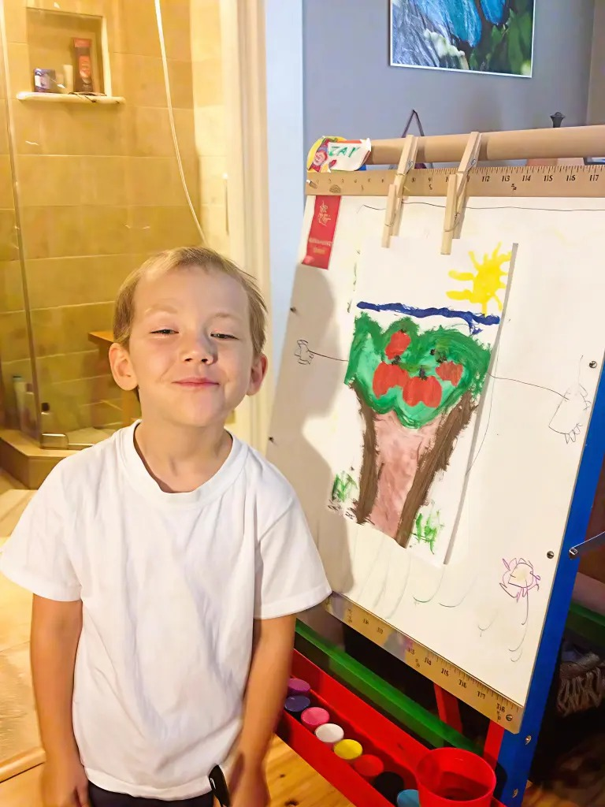

# Getting through the fog of grief to see clearly on the other side

**Having pulmonary hypertension helped teach me what matters most in life**

By Jolie Lizana

## Image/caption placement

Image 1: images/articles/phlip-side/fog-of-grief-zaylan-apple-tree.jpg

Caption: In this photo from 2013, Jolie Lizana’s son, Zaylan, 5, smiles next to his painting of an apple tree. (Photo by Jolie Lizana)

Alt text: A young boy in a white t-shirt smiles next to an easel displaying his colorful painting of a tree with red apples, green leaves, a blue sky, and a yellow sun.

---

<!-- BTA_IMAGE_START -->

*In this photo from 2013, Jolie Lizana’s son, Zaylan, 5, smiles next to his painting of an apple tree. (Photo by Jolie Lizana)*

<!-- BTA_IMAGE_END -->

When pulmonary hypertension (PH) crashed over me, it caused me to mourn the loss of my health, my life’s work, and my dreams. It left me with a crazy mess of grief.

When a social worker came to see me at the hospital a few days after my diagnosis, I told her I was experiencing grief, but it was bouncing around like a pinball. There was no order to any of it. She explained that it was to be expected, as grief and mourning are a journey toward acceptance.

I grieved in ridiculous fashion. Denial was prominent. I knew I was very sick. That much I accepted, but I refused to accept that I wouldn’t get better. I refused to accept that I was going to die and leave my son alone in this world. After the anger subsided, I tried to figure out what to do next. Depression and bargaining weren’t going to fix anything, and I sure wasn’t going to accept my prognosis, which left me with denial.

## The things I told myself and others

I remember telling myself, day in and out, that I would get better. I just had to allow myself time to rest and heal, but I would get better.

I spent about eight months in the hospital during the first year after my diagnosis, but it wasn’t continuous. I was never home for more than a week and never in the hospital for less than a week. Yet I knew I was going to get better. That’s what I told myself.

When I was home, I spent most of my time in bed. I couldn’t do much of anything.

Before my diagnosis, I wouldn’t allow my son to sleep with me unless the weather was bad or he was sick. I encouraged his independence. But after learning about my condition, I worried that the doctors were right about the number of years I had left, so on the nights he would ask if he could sleep with me, I’d usually let him. I wanted to spend as much time with him as possible.

Some nights, I did tell him no. Thinking of the pain on his face still tears me up. I hated hurting him! The nights I said no were the ones I most wanted him by my side. These were the nights I didn’t think I would live through. Although I wanted to hold him, the last thing I wanted was for him to wake up cuddled next to his dead mom. I never knew I had so much willpower. My pillow was soaked with tears on those nights.

PH exacts a tremendous mental toll on the people who have it, but for me, in the beginning, it was catastrophic, even though I didn’t tell anyone. I didn’t want anyone to worry about me more than they already did. Even when I was at my weakest, I was worried about everybody else.

When I had visitors at home or in the hospital, I joked and talked about everyday things. A couple of days after my diagnosis, my sister and others came to visit. We were all laughing when I heard my sister say, “Yep, that’s Jolie. She’s just being Jolie. Making us all laugh.”

I kept everything in; no easy task! Family surrounded me, but I’d never felt so alone. I talked, but said nothing. It was a grievous, helpless time, and not being able to do things with my son was the worst part.

## A clearer picture

One day, I pulled my son’s art easel next to my bed to watch him paint. It had taken all of my strength, but I felt myself becoming more alive with every brushstroke he made. Spending time with him was reinvigorating, and I found my resilience returning. His being there with me reminded me why I needed to keep going.

I have that painting he made of an apple tree framed and hanging on my wall. It reminds me of my happiest moments during the most trying times, and of how far I’ve come. We need reminders to help us focus and draw strength. We won’t win the fights over our illness every day, but we’re still here! We’re winning. Being in denial about my illness helped me live, but having reminders and being able to remember helps me thrive.

Being one of the roughly 10% of people in the U.S. with a rare disease has helped me recognize what’s truly important in life. As I look at my apple tree, I can’t help but think how lucky I am to be among the select few who get to see the world so clearly.

What helps you thrive? Please share your thoughts in the comments below. Follow me at Breathtaking Awareness.
