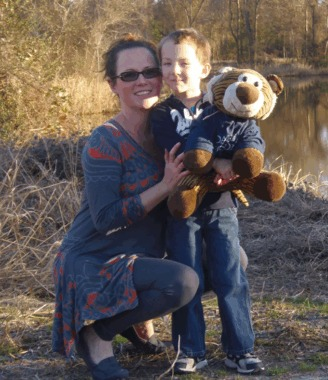

# Grieving the mom I used to be before PH entered my life

**It's hard not to notice the vast difference in my life then vs. now**

By Jolie Lizana

Publication date: February 13, 2026

## Image/caption placement

Image 1: images/articles/phlip-side/grieving-mom-state-park-2014.jpg

Caption: Jolie Lizana and her son, Zaylan, visit their local state park in 2014. (Courtesy of Jolie Lizana)

Alt text: A woman squats down beside her son for a photo at their local state park. The boy is holding a stuffed tiger, and both are smiling at the camera.

---

<!-- BTA_IMAGE_START -->

*Jolie Lizana and her son, Zaylan, visit their local state park in 2014. (Courtesy of Jolie Lizana)*

<!-- BTA_IMAGE_END -->

Nothing I’ve done has helped prepare me for the sudden flashbacks to when I was healthy, active, productive, and all those pretty words my body no longer computes. It happens so suddenly — a gut punch, a reminder of the life I used to have.

Almost everything about me has slowly faded away. I’m a completely different person than I used to be, and in some regards, that’s a good thing. But this transformation has also meant leaving so much behind.

When pulmonary hypertension (PH) takes hold, no mindfulness practices, Zen yoga, or medication techniques can prepare me for the moments when I’m hit with a memory and the thought, “Oh, yeah. I used to do that. I used to be a good mom.”

## A painful contrast

I don’t intend to note the vast differences, but I can’t help it when I see pictures of me with my child actually doing things. I don’t mean vacations, though we did have them, and I cherish those memories. What I’m talking about is more substantial to me. I miss making costumes for the children’s plays, being the art mom and room mom, participating in bake and book sales, working the Christmas shops at school, taking field trips, and everything else a parent can do with a school-aged child. Being present wasn’t extra; that’s who I was.

Suddenly, with PH, the breathlessness, extreme fatigue, and fainting made it a challenge to do much of anything, much less our norm: going to the state park, picnicking, hiking the trails, and splashing down the waterslides. We were always up for an adventure.

After my diagnosis, I couldn’t even sit up in the front room to watch my son play outside. He would go out with my aunt to play. She had been teaching him how to ride his bike without training wheels one day when she came running inside, so excited. She said he was doing it. I had to see.

I made it to the porch chair, but not even 30 seconds passed before my body crashed. I barely made it inside the door before I collapsed to the ground. It’s a miserable feeling to envy those who can sit outside or walk.

Those days are gone. My child is now nearly 18, and thankfully, I can sit outside or go for a walk on most days. Of course, there are other things that I grieve, even as my grief continues to change.

## What we’ve lost

The other day, I had a terrible breakdown. I came across some old pictures and an ingredients sticker for trail mix. I’d made treat bags for my son’s classmates and affixed a sticker listing the ingredients. The images were bittersweet, but it was the sticker that I’d made over a decade ago that broke me.

I cried for all of the bake sales, performances, trips to the park, and trail mix that we missed. I cried because I don’t get a do-over, and I can’t make up for the school years that have passed. I sobbed uncontrollably because my son missed out on so much due to my illness. It’s not fair to him. I know PH is to blame, but the guilt still weighs on me.

The thought of him growing up without me is far more traumatic, and so I remind myself of that, but only after I grieve for all he’s lost. I can rationally understand that I’ve done a great deal with him, even after my diagnosis, and I am grateful to have valuable time and heartwarming memories.

Sure, things have shifted, and we’ve done things together we never would have if I had been healthy and working 40 hours a week. But that doesn’t mean I don’t grieve the life I had envisioned for us.

I don’t have it figured out. I don’t know where to go from here, and I don’t have a grand plan. I’m just moving forward in any direction that feels right. I make my decisions by thinking about how I want to be remembered.

That might sound a bit morbid, but it’s not. I’m not preparing to die. I’m preparing to live the rest of my life with purpose. It’s a slow, winding journey toward building a new existence. There’s nothing easy about it, and there will be more pitfalls, but I need to keep moving forward. I can either continue to grieve a decade from now or look back with a sense of pride.

I hope to look back grief-free, with photos of my son and me, and see that the life I’ve lived, even after all of the loss, was meaningful.

For more insights, follow me on Instagram at BreathtakingAwareness.
