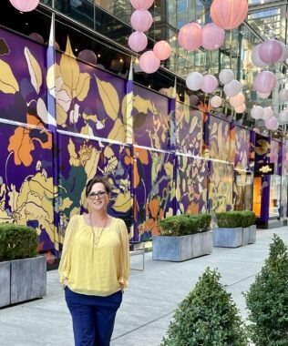

# I’m learning how to live fully, not just survive, with pulmonary hypertension

**Finding ways to keep moving forward, even within the limits of PH**

By Jolie Lizana

Publication date: April 10, 2026

## Image/caption placement

Image 1: images/articles/phlip-side/live-fully-dc-mural.jpg

Caption: Columnist Jolie Lizana spends time in Washington, D.C., after a day of advocacy in March 2026. (Courtesy of Jolie Lizana)

Alt text: A woman wearing a yellow top and blue slacks smiles for a photo in an outdoor walkway with a colorful mural and pink and purple lanterns.

---

<!-- BTA_IMAGE_START -->

*Columnist Jolie Lizana spends time in Washington, D.C., after a day of advocacy in March 2026. (Courtesy of Jolie Lizana)*

<!-- BTA_IMAGE_END -->

Pulmonary hypertension (PH) is a serious and life-threatening disease. There was a time when the hardest part was simply staying alive, getting through each day, and not knowing what came next. But as my health has improved, the challenges have changed. The hardest part for me now isn’t survival. It’s learning how to live within limits that still shape every part of my life, even as I grow stronger.

From the outside, it may look like I am simply going about my day. What isn’t visible is the constant awareness running in the background. Every decision is filtered through questions most people never have to ask.

Do I have enough energy? Is this safe? What will this cost me later? I am always calculating, always preparing for what could go wrong. What if I get short of breath? What if I can’t recover quickly? What if I need help? These are not occasional thoughts. They are built into how I move through life.

Before PH, I didn’t think this way. I trusted my body without question. I made plans without hesitation. I said yes without weighing the consequences. Now, even simple things require intention.

Leaving the house isn’t just leaving the house — it’s planning, pacing, and preparing for outcomes that may or may not happen. That shift isn’t always visible to others, but it changes everything. There are days when I may look fine, when nothing appears wrong on the surface. What people don’t see is the energy it takes just to maintain that appearance.

## Conserving energy like it’s a limited currency

Some days, basic tasks take everything I have. Other days offer more freedom, but the awareness never fully leaves. There is always a line I cannot cross, even if no one else can see it. The people who care for me notice what others might miss. They pay attention to my breathing, my energy, the subtle changes that signal I am pushing too far.

They step in when needed, sometimes before I even realize it myself. Their presence brings a sense of safety to a life that can feel unpredictable. At the same time, accepting that level of support has been an adjustment. Letting go of the independence I once had is not a challenge anyone else can see, but it is something I feel every day.

Because so much of this condition exists beneath the surface, people often don’t realize how much has changed. My life has had to shift in ways that are not obvious from the outside. I have gone back to college, choosing a path that allows me to work from home and build a future my body can sustain. That decision was not just about ambition. It was about adaptation. It was about understanding my limits and working within them.

I’ve even had to reconsider the things that once brought me joy. Some environments are no longer safe. Some activities require more than I can give.

Letting those things go isn’t always noticeable, but it is a quiet process of loss and adjustment. In their place, I have had to find new ways to stay engaged, feel connected, and create meaning within new boundaries.

## Learning to live in a body that changed the rules

Living with PH isn’t just about managing symptoms or following treatment plans. It’s about balancing caution with the desire to keep moving forward. It’s about carrying both grief and determination, even when neither is obvious to anyone else. There is resilience in this, but it is not loud. It does not look the way people expect. It shows up in the small, daily choices. In the adjustments. In moving forward within my limits.

PH will always be serious; that reality does not go away. But for me, the hardest part now is learning how to live fully within what remains, even when much of that effort cannot be seen.

If this journey has taught me anything, it’s that life doesn’t have to look the way we planned for it to still hold meaning. Even within limits, there is room to grow, rebuild, and find a new kind of happiness. I am still a work in progress, but maybe I always have been.

For more of my journey, follow me at BreathtakingAwareness.
