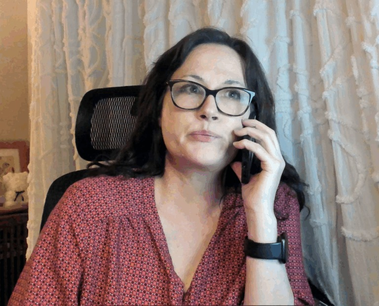

# The high cost of time spent managing a chronic illness

**Patients shouldn’t have to spend so much time on disease management**

By Jolie Lizana

Publication date: October 24, 2025

## Image/caption placement

Image 1: images/articles/phlip-side/high-cost-phone-call.jpg

Caption: Living with a chronic, rare disease involves a lot of time on the phone. (Courtesy of Jolie Lizana)

Alt text: A woman with glasses and dark hair, wearing a red patterned blouse and a smartwatch, sits on a black chair and talks on the phone.

---

<!-- BTA_IMAGE_START -->

*Living with a chronic, rare disease involves a lot of time on the phone. (Courtesy of Jolie Lizana)*

<!-- BTA_IMAGE_END -->

My rear end is sore from the gurney, my headache is growing roots thanks to the beaming fluorescent lights, and my chest feels no better than it did when I arrived at the emergency room. So why did I come?

After being curled up in my blankets at home for nearly 24 hours, my headache finally subsided, and I was able to peel myself off the sheets. The barometric pressure had nastily partnered with my systemic sclerosis to remind me of its powers, making my bones feel like they were in a vise.

I hate the ER, but having pulmonary hypertension and heart failure means I must get checked out when I have these pains. Even when I’m having chest pains that make my knees buckle, and it takes all my willpower not to groan or scream, I’ll try to bargain with myself to avoid going to the ER.

On this day, I’d put off going to the hospital. I took a shower and told myself, “OK, if my chest starts hurting again once I’m back in bed resting, then I’ll go to the ER.”

After my shower, I emerged from behind the “curtain of fresh starts” a new person. I slipped into comfy pajamas that I could wear for a late-night ER trip, just in case I ended up going, and made sure there was no metal anywhere on my person. It’s my go-to move on nights like this.

My bag was propped by the front door, at the ready. It held my headphones, laptop, chargers, chapstick, eye mask, bank card, insurance card, license, and keys. Slip-on sneakers sat to the side, and a pullover was folded on top. I climbed into bed.

It wasn’t long before the chest pain returned. I tried bargaining once more, but my heart reminded me who’s boss. I conceded and headed out the door like a child. I rolled my eyes and muttered, “Ugh, I don’t want to go!” under my breath as I climbed into my Subaru.

I know I must get my heart checked out when my chest hurts like that, but the process isn’t quick or easy. After four hours of tests — including an electrocardiogram, blood work, X-ray, and CT scan — and consultations with three nurses and a doctor, I learned I was fine.

“I hate coming here for nothing,” I told the doctor.

“With your history, it’s best that you come in when you have these pains,” she said. “It’s better to come in and not find anything emergent than to stay home and have an emergency.” And she’s right, of course, but these trips still suck.

## Paying twice for needed care

The tedious and time-consuming tasks and phone calls that come with living with a chronic illness really add up. These kinds of ER trips only increase the toll.

Suppose we were paid for our time spent at the hospital, refilling medications with specialty pharmacies, or dealing with medical scheduling and insurance. In that case, we might be able to pay for our medications without needing to make four phone calls for a prior authorization.

We in the rare disease community don’t often talk about the amount of time we spend managing our health. Healthy people often don’t realize how much time it takes to simply survive, much less thrive. Maybe we don’t talk about it because it’s a given; there’s not much we can do about it.

That’s where I start to wonder: Is there a better way? For instance, some states have passed laws extending prior authorization periods, while others have proposed similar legislation. Let’s think big picture and create more solutions like this!

There have to be other ways to keep sick patients and our loved ones from spending so much time on the phone and filling out medical forms that we have to email, fax, or snail mail — without forgetting to cross a “t” or dot an “i” — to potentially receive services. Too much time is wasted on purely surviving with chronic illness.

This is time and energy patients like us don’t have, yet it’s being taken anyway. Some say time isn’t a commodity, but it feels like ours is. Time is currency when we have rare and chronic conditions. We are paying it for medications, tests, and doctor visits that have already been paid for.

What does your time pay for? Please share in the comments below. You can also follow me on Instagram at BreathtakingAwareness.
