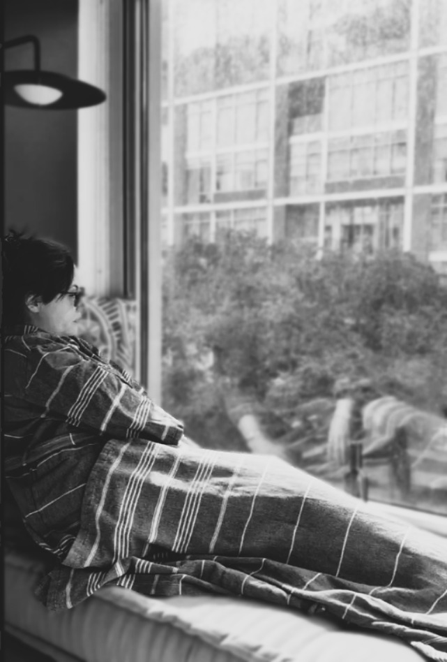

# The Pandora’s box of making plans and managing friendships with PH

**People stopped inviting me to things because of my unpredictable symptoms**

By Jolie Lizana

## Image/caption placement

Image 1: images/articles/phlip-side/pandoras-box-window-rain.jpg

Caption: Columnist Jolie Lizana gazes out into the world. (Photo by Zaylan)

Alt text: A person wrapped in a striped blanket sits on a window seat, gazing out of a large window on a rainy day.

---

<!-- BTA_IMAGE_START -->

*Columnist Jolie Lizana gazes out into the world. (Photo by Zaylan)*

<!-- BTA_IMAGE_END -->

My body allows me to do many things on some days, and not much on others. Because I never know which days will be fair to partly cloudy, making it to appointments and keeping plans with friends is like hitting a bull’s-eye on a dartboard while wearing a blindfold. I can give it my all, but I have no way of knowing where that dart will land.

My pulmonary hypertension symptoms can go from a blizzard to a heat advisory and back within minutes. It’s a fun ride if you like never knowing what’ll happen next.

After my diagnosis, when I was finally well enough to do things, I thought it best not to make plans with people because I didn’t want to be a flake. Instead, I was the “If I can make it, I’ll come” person that everyone is secretly frustrated with.

Of course, I wanted to keep appointments and follow through with plans to spend time with family and friends, but I had no way to ensure that I could. At that point in my life, I was being as honest as I could with myself and everyone else. Unfortunately, the replies quickly changed to “OK, sounds good!” But I could see it on their faces: I’d become almost irrelevant.

Consequently, I adopted a new approach. I became the “I don’t think I’ll be able to make it” person who’d occasionally show up and surprise everyone, which required the host to rearrange the seating at the last moment. I quickly learned that people aren’t fans of the unexpected guest unless you’re volunteering for something.

People love it when you show up without notice to volunteer. As an unexpected helper for school functions, I was a hero to the parent-teacher association. It felt great to be appreciated after feeling guilty for being unable to do so many other things. The “unexpected helper” is still my go-to for volunteering opportunities.

However, showing up and single-handedly conducting a game of musical chairs didn’t get such a good response. I became the “No, I can’t make it” person who eventually stopped being asked to do things. I was dropped.

## Those that’ll be there

I’ve since lost nearly all of my friends. I talk to a few of them from time to time. I rarely do things with anyone other than those in my household. I invite people to do things only at the last minute, because that’s when I know I can make it. And I don’t like to be relied on for anything — yet I want to do everything. It’s exasperating!

My mind role-plays what I would do as a healthy person, which causes anxiety. I read somewhere that ambition without action causes anxiety. I’m not physically able to follow through with all of the ideas and projects in my mind, so I wonder if that’s why I have so much anxiety.

Then I think about the chicken and the egg. Is it possible that anxiety helps me think of things to do because I can’t sit still for too long doing nothing? Maybe it’s the attention-deficit/hyperactivity disorder I was finally diagnosed with in my 40s. Maybe I’m anxious because I want to start over and make new friends, go to the movies, and attend dinner parties.

I want that life: a life where I can make plans again. It’s so exciting to think about, but I always cut off the thoughts bluntly because in the back of my mind, a voice is asking me if it’s worth it, knowing that the new friends will last for only one cycle of flakiness, flightiness, irrelevance, and nuisance before I’m dropped.

It’s stressful and draining to even think about the depression that follows losing everyone. I imagine that far too many members of our PH community have experienced the same thing. But something fortifying emerges from losing most of your friends: There’s solace in knowing that the remaining friends will always be there. There’s a closeness that transcends words, and last-minute invites are always welcomed and appreciated on both sides.
