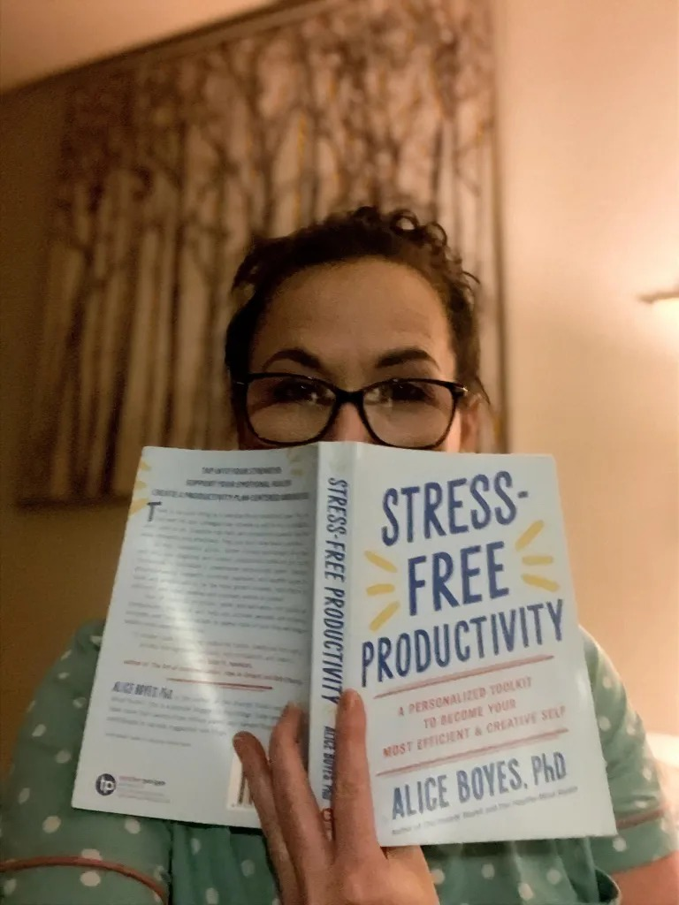

# Why a day of rest is a victory with pulmonary hypertension

**Moments to relax are not an option when every activity can be a struggle**

By Jolie Lizana

## Image/caption placement

Image 1: images/articles/phlip-side/rest-victory-reading.jpg

Caption: Columnist (Photo by: Jolie Lizana)

Alt text: Jolie in polka dot top pajamas holds up and reads the book Stress-Free Productivity, partially covering her face in a softly lit room.

---

<!-- BTA_IMAGE_START -->

*Columnist (Photo by: Jolie Lizana)*

<!-- BTA_IMAGE_END -->

Those of us in rare disease communities have learned one lesson particularly well: We all must listen to our bodies.

That’s why a celebration like National Relaxation Day — which happens to be Aug. 15, the day this column was published — is such an apt reminder. Many will take this opportunity to relax and rejuvenate their minds and bodies.

I have both pulmonary hypertension (PH) and advanced heart failure. The constant lack of oxygen throughout my body keeps its insatiable need for rest at the forefront of my mind. Every activity I engage in requires me to consider the possibility that I’ll need to sit down, lie down, or leave immediately, as I may spontaneously require recharging for hours.

At times, I feel like a covert agent in a shadowy world. My “agencies” — the diseases I face — wield silent power over my life. My disguise, which is a seemingly healthy exterior, allows me to blend in effortlessly. I possess an instinctive awareness of the best exit strategies, my secret arsenal consists of pills that grant me fleeting strength, and I communicate in a language understood only by those who also navigate within the realm of rare disease communities.

Unfortunately, my poor health has taken over my life. That seems to be the fate of most of us with PH. We reach a point where we can’t control how we spend our days, try as we might.

Pushing myself used to mean running an extra half-mile. That was good for my health, and it felt great. I rested and rebounded quickly. Now, pushing myself can mean doing a load of laundry and then not being able to hang it and put it away until later.

However, I do have some days when pushing myself can mean walking for a mile or more. My PH pressure fluctuates like an unattended toddler with a dimmer switch. I have to wait and see where the switch was left, gauge my capabilities, and hope the toddler doesn’t come back anytime soon.

We must understand and listen to the constant demands of our bodies. The body always collects its debts!

I wholeheartedly mean it when I tell others in the PH community to rest, take it easy, and not let others’ misconceptions and judgments affect them. Yet I don’t always give myself the same grace. I’m thinking I’m not alone here, so:

## To my fellow PHighters:

If you feel too exhausted to do even simple things, recognize your heart’s working overtime to deliver essential oxygen. Your exhaustion is valid!

If you appear to be physically healthy, though your heart functions as though you’d run a marathon simply from doing mundane tasks, take the win! No one wants to see your lungs and heart on the outside; trust me, I’ve asked around.

If you face expectations from others about doing more, know you’re not alone. Far too many people struggle to see beyond the surface. Remind yourself that the privilege others have in not understanding PH is a blessing. We don’t genuinely want more people living with this disease.

If you sometimes wish that others could experience what you go through for just one day, I get it! I often wish others understood. Just know that it’s not your responsibility to educate everyone, especially those unwilling to learn.

If you choose to spend quality time with your loved ones instead of doing the dishes when you finally have energy to do something, way to go! It’s triumphant to allow yourself to live rather than exist in a society filled with harmful assumptions that someone’s physical appearance dictates their capabilities.

## Far too many

Many people underestimate “invisible” conditions, often judging a person’s capabilities solely on their appearance. This tendency dismisses serious diagnoses.

Yet these types of misconceptions are prevalent in the PH and rare disease communities. It’s saddening to see how easily empathy can be cast aside, revealing a more profound ignorance that only serves to isolate those who need understanding the most.

We should be listening to our bodies and not others’ foolish judgments. Our daily depression and guilt for not being able to do all that we wish we could are enough to contend with. We should extend the same grace to ourselves that we would give to others in our community.

Not just on National Relaxation Day, but every day, let’s work on allowing ourselves some guilt-free rest and reminding ourselves to celebrate everything we accomplish, rather than be hard on ourselves for what we didn’t.

I myself love to celebrate with ice cream. I’m down for any excuse to enjoy the cold, creamy deliciousness!

How will you observe National Relaxation Day?
